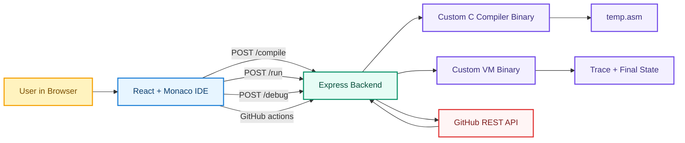
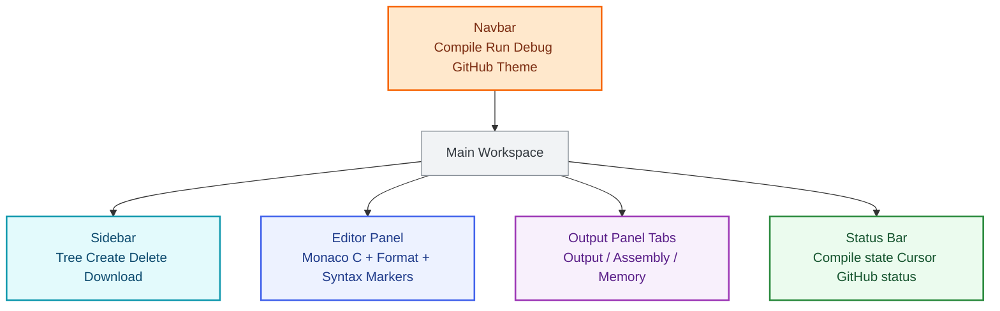
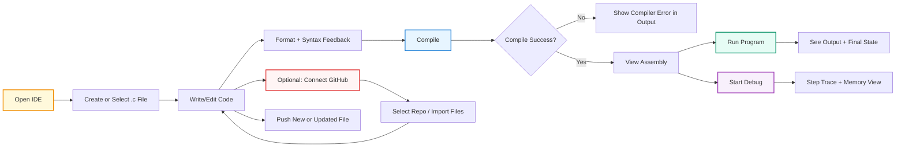
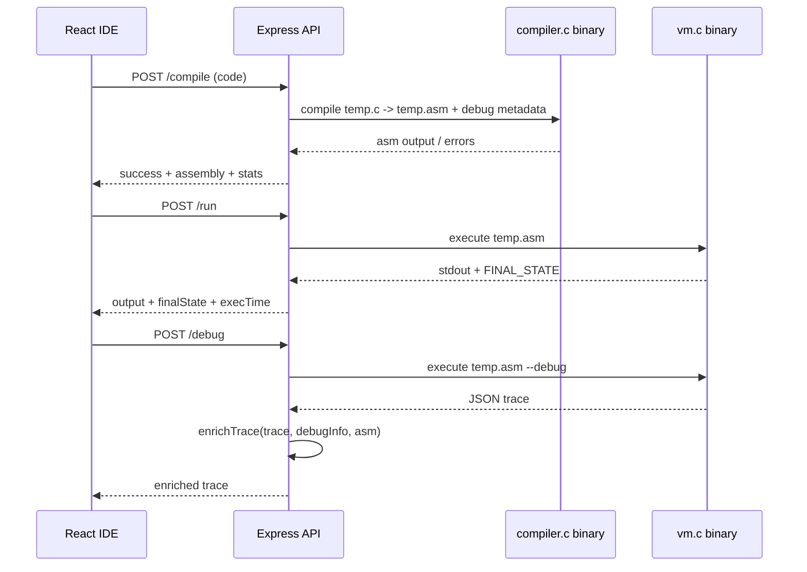
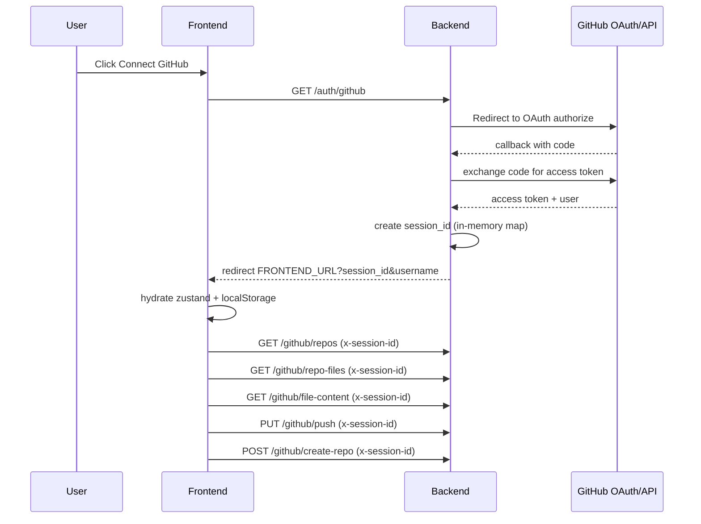

# VoltC - Real-Time C Compiler IDE

> OpenPool Doppelganger Hackathon submission by **CodingKarma**

`VoltC` is a web IDE focused on rapid C prototyping for embedded-style workflows. It compiles C into a custom ISA, runs it on a custom VM, and visualizes execution/memory state with a debugger-first UI.

## Team

- Team Name: **CodingKarma**
- Built by:
  - **Parth** - [@PARTH-JADAV20](https://github.com/PARTH-JADAV20)
  - **Aashish** - [@Aashish-gif](https://github.com/Aashish-gif)

## Hackathon Problem Mapping

From the provided challenge statement (`temp.txt`), this project addresses:

- Real-time C editing and feedback with syntax validation in Monaco.
- Compilation to a simplified custom ISA.
- Program execution and output display in-browser via backend APIs.
- Memory/debug visualization including stack/register behavior across trace steps.
- Fibonacci-style recursive execution support with trace-based debugging.
- Additional productivity features beyond baseline:
  - GitHub OAuth integration.
  - Fetch/import `.c` files from repositories.
  - Push new/updated `.c` files back to GitHub.
  - Create repositories directly from the IDE.

## Core Features

### IDE Experience

- Monaco C editor with dark/light theme support.
- Per-file editor models for smooth file switching.
- Real-time syntax checks with inline error markers.
- One-click and hotkey formatting (`Shift+Alt+F`) plus top-right format button.
- Auto-save (debounced) with unsaved-change indicators.
- File explorer with:
  - Create file/folder
  - Delete file/folder
  - Download file
  - Folder tree and sorting

### Compiler + Runtime

- Backend C compiler (`backend/src/compiler.c`) that tokenizes/parses C and emits custom ISA assembly.
- VM runtime (`backend/src/vm.c`) that executes custom ISA instructions.
- Compile endpoint returning assembly and compile metadata.
- Run endpoint returning program output, execution time, exit code, and final VM state.

### Debugging + Memory Visualization

- Debug endpoint executes VM in trace mode (`--debug`).
- Trace enrichment in backend maps PC/function/variables/call stack.
- Frontend memory panel shows:
  - Instruction timeline
  - Register values
  - Stack/BP/SP visuals
  - Variable table
  - Step-by-step navigation (next/prev/jump)

### GitHub Integration (OAuth + Repo Ops)

- OAuth login from IDE through backend.
- Session-based token management (in-memory on server, session id on client).
- Fetch user repositories.
- Browse/import `.c` files from selected repository.
- Push updates or create new files in repository.
- Create new repository from IDE dialog.

## Tech Stack

### Frontend

- **Vite 6** + **React 18** + TypeScript
- **Monaco Editor** (`@monaco-editor/react`)
- **Tailwind CSS 4**
- **Radix UI** primitives (shadcn-style component layer)
- **motion/framer-motion** for UI animation
- **next-themes** for theme switching
- **zustand** for GitHub session/file tracking state
- **sonner** for toasts

### Backend

- **Node.js + Express 5**
- **axios** for GitHub API calls
- **gcc-compiled C binaries** for compiler + VM
- **dotenv** for environment config

### Tooling

- Frontend build/dev: `vite`
- Backend build: `gcc src/compiler.c -o compiler && gcc src/vm.c -o vm`

## System Architecture



## IDE Wireframe (Logical)



## User Flow



## Compile / Run / Debug Execution Flow



## GitHub OAuth + Repo Flow



## Backend API Reference

| Endpoint | Method | Purpose |
|---|---|---|
| `/compile` | `POST` | Compile C code into custom ISA assembly |
| `/run` | `POST` | Execute latest compiled assembly in VM |
| `/debug` | `POST` | Run VM in debug mode and return trace |
| `/auth/github` | `GET` | Start GitHub OAuth flow |
| `/auth/github/callback` | `GET` | OAuth callback, creates `session_id` |
| `/github/repos` | `GET` | Fetch user repositories |
| `/github/repo-files` | `GET` | Fetch `.c` files from selected repo |
| `/github/file-content` | `GET` | Fetch a file's content + SHA |
| `/github/push` | `PUT` | Create/update file in GitHub repo |
| `/github/create-repo` | `POST` | Create new repository |

## Project Structure (High-Level)

```text
Doppelganger/
  src/
    app/
      pages/IDE.tsx
      components/ (Navbar, Sidebar, Editor, OutputPanel, MemoryPanel, GitHub dialogs)
      utils/ (api.ts, c-formatter.ts, c-syntax-checker.ts)
    store/githubStore.ts
  backend/
    server.js
    src/compiler.c
    src/vm.c
  public/
    favicon + manifest assets
```

## Local Setup

### 1. Frontend

```bash
npm install
npm run dev
```

### 2. Backend

```bash
cd backend
npm install
npm run build
npm start
```

## Environment Variables

### Frontend (`.env`)

```env
VITE_API_URL=http://localhost:3001
```

### Backend (`backend/.env`)

```env
PORT=3001
GITHUB_CLIENT_ID=your_github_client_id
GITHUB_CLIENT_SECRET=your_github_client_secret
GITHUB_CALLBACK=http://localhost:3001/auth/github/callback
FRONTEND_URL=http://localhost:5173
```

## GitHub OAuth Setup

1. Create OAuth app at `https://github.com/settings/developers`.
2. For local:
   - Homepage URL: `http://localhost:5173`
   - Authorization callback URL: `http://localhost:3001/auth/github/callback`
3. For production:
   - Homepage URL: your frontend domain (Vercel)
   - Authorization callback URL: your backend domain + `/auth/github/callback` (Render)

---

Made with love by **CodingKarma**. Thank you for checking out our OpenPool Doppelganger hackathon project.